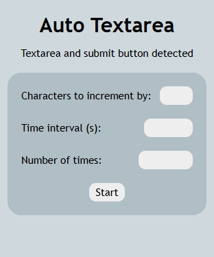

# Auto-Textarea
Chrome extension that automates inputs for a HTML textarea tag. I wonder what that could be useful for...
### Features
- Options for the character(s) to increment by, time interval, and number of times
- Simple and easy design
### Limitations
- Only works on the first textarea and input button on a webpage, whatever that may be

